***
## 📥 Download My Updated Resume

[-FF6B6B?style=for-the-badge&logo=downloadicon&logoColor=white)](https://github.com/shemanto27/shemanto27/raw/main/resume/Bidut_Sharkar_Shemanto_Backend_Developer_Resume.pdf)

***

**Languages**

**Frontend Technologies- Web + Mobile App**

**Backend Technologies**

**IoT & Embedded Systems**

**Databases & ORMs**

**AI & Machine Learning**

**DevOps & Infrastructure**

<h2 align="center">Projects in my Portfolio!</h2>

***
# DevOps/MLOps
| Project Link | Timeline | Tools | Project Description | ProjectVideo |
|---|---|---|---|---|
|  [End-to-End DevOps in Library Management & Borrowing System](https://github.com/shemanto27/Django-Library-Management-Borrowing-System) | Aug 2025 - | Docker, CI/CD, Terraform, Ansible, AWS, Kubernetes, Grafana, Prometheus | Implemented End-to-End DevOps from Dockerizing an App, create infrastructure in AWS using IaC - Terraform + Ansible, CI/CD to DockerHub and EC2 using Github Action, Monitoring using Grafana and Prometheus, orchrestration using Kubernetes |  |

***
# Python/Django Projects

| Project Link | Timeline | Tools | Project Description | ProjectVideo |
|---|---|---|---|---|
| [Game Price AI](https://github.com/shemanto27/GamePriceCheckerAI)  | Oct 2025 - | Django REST Framework, Next.js, Docker, AWS, GitHub Actions  | User Scan Game cover using OCR, AI will compare the game with external game API and show prices and details of the game, shows price changes over time |  |
| [Menu SideKick - AI Flutter App for Restaurant Menu Check](https://github.com/shemanto27/Menu-Sidekick-STA) 🔒 | Oct 2025 - | Django REST Framework, Flutter, Docker, AWS, GitHub Actions, OPenAI  | User choose his health condition, allergies, preferred diet and deails when registering in the app. Later he scan menu in restaurants, AI assist which dishes best fit for him, which not |  |
| [Mon5Majeur - AI Flutter App for Restaurant Menu Check]() 🔒 | Dec 2025 - | Django REST Framework, Flutter, Docker, AWS, GitHub Actions, Redis, Websocket | MON5MAJEUR is a modern NBA Fantasy Basketball platform where users can create fantasy teams, join leagues, compete against friends, and track live scores. Built with Django REST Framework, featuring real-time updates via WebSockets, Docker deployment, and AWS integration.  |  |
| [PeoplesList - Full Stack Django and React Web App Combines Goggle Sheet and Google Form in one Page](https://github.com/shemanto27/ScholarPage) | March 2025 - | Django REST Framework, React.js , Daisy UI, Tailwind CSS, Docker, AWS, GitHub Actions  | Managing your department, alumni, or club member list shouldn't be a hassle.PeoplesList is a lightweight web app designed to simplify group member management with a single shared link. One link to:Create and share your group's member list, Allow members to view others and register themselves, Protect access with a shared password, Moderate new entries before they appear, View smart insights through graphs, Email all members instantly |  |
| [ScholarPage – Portfolio builder for researchers and students](https://github.com/shemanto27/PeoplesList) | March 2025 - | Django REST Framework, React.js , Daisy UI, Tailwind CSS, Docker, AWS, GitHub Actions  | ScholarPage is a simple, customizable portfolio builder designed specifically for academics. It allows users to showcase their education, research work, publications, projects, and achievements without needing to code — all with a clean, professional UI. |  |

***

# Machine Learning & Deep Learning Projects

| Project Link | Timeline | Tools | Project Description | ProjectVideo |
|---|---|---|---|---|
| [BanglaFoodViT](https://github.com/shemanto27/BanglaFoodViT) | 2025 | Pytorch | Bangladeshi Food Classification using Vision Transformer. Built a Vision Transformer (ViT) from scratch using PyTorch |  |
| [Credit Risk Modeling of Banking Data](https://github.com/shemanto27/Credit-Risk-Modeling-on-Bank-Data-using-Machine-Learning) | 2025 | ScikitLearn, XGBOOST | Develop a ML model that can accurately predict credit risk for loan applicants based on historical data and financial metrics |  |

***

# Generative AI, LangChain, LangGraph Projects
| Project Link | Timeline | Tools | Project Description | ProjectVideo |
|---|---|---|---|---|
| [Tax Assist - AI Bangladeshi Tax Expert using LangChain](https://github.com/shemanto27/TaxAssist) 🔒 | 2026 | RAG System, LangChain, Text Embedding, Vector Database, Kubernetes, Docker, FastAPI | AI Tax helper RAG system completly build with microservices structure - separate docker container for each components of RAG pipeline. Ready to scale up with kubernetes |  |
| [LinkedIN MCP Server with Claude](https://github.com/shemanto27/TaxAssist) 🔒 | 2026 | RAG System, LangChain, Text Embedding, Vector Database, Kubernetes, Docker, FastAPI | AI Tax helper RAG system completly build with microservices structure - separate docker container for each components of RAG pipeline. Ready to scale up with kubernetes |  |

***

# IoT Projects
| Project Link | Timeline | Tools | Project Description | ProjectVideo |
|---|---|---|---|---|
| [End-to-End IoT Project using ESP-IDF Room Temperature and Humidity Monitoring Device](https://github.com/shemanto27/End-to-End-IoT-Project-using-ESP-IDF-Room-Temperature-and-Humidity-Monitoring-Device) | 2026 | ESP32, MQTT, Django, React, Docker, AWS | End-to-End IoT Project using ESP-IDF Room Temperature and Humidity Monitoring Device |  |

***

  

